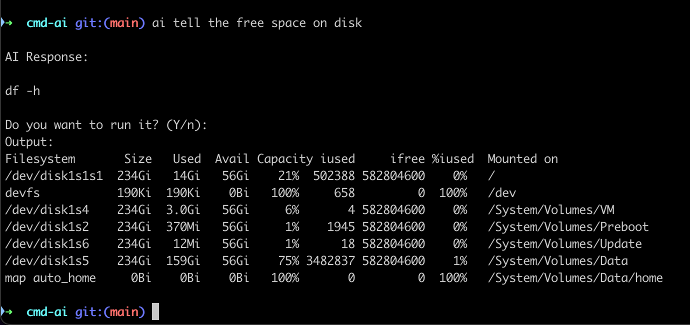

# cmd-ai

**cmd-ai** is a natural language shell assistant powered by AI. It turns plain English (or any prompt) into real, executable shell commands — with safety, explanation, history, and autocompletion built-in.



## Installation

To install `cmd-ai`, use the following command:

```bash
npm install -g cmd-ai
```

Ensure you have Node.js installed on your system before proceeding with the installation.

## Configuration

Before using the assistant, set your OpenAI API key:

```bash
ai config
```

Your key is securely stored in:

```bash
~/.ai-config.json
```

## Usage

Once installed, you can invoke this library using the `ai` command. For example:

```bash
ai Tell me how much free space is left on the disk
```

This will first display the suggested command based on your input. If you confirm by pressing "Enter," the command will then be executed.

Here some pre-defined commands:

```bash
ai [your task here] [--flags]
ai list all running Docker containers
ai remove all .DS_Store files recursively
ai config                         # Set your OpenAI API key
ai history                        # View past commands
ai man                            # Show help
ai install-autocomplete           # Automatically set up autocomplete
```

## Flags

- `--explain` – Ask AI to explain the command before returning it.
- `--dry` – Show the command but don’t execute it.
- `--help` or `-h` – Show help screen.

## Shell Autocompletion

Generate and install the autocompletion script:

```bash
ai install-autocomplete
```

This will:

- Generate the autocomplete script at `~/.cmd-ai-completion.sh`
- Add source `~/.cmd-ai-completion.sh` to your `.bashrc` or `.zshrc`

## Safety

`cmd-ai` is designed with safety in mind. It includes mechanisms to filter harmful or inappropriate content. However, always review AI-generated outputs before using them in critical applications.

## History

All AI-generated commands are saved (with timestamp and status) in:

```bash
~/.ai-command-history.json
```

View them using:

```bash
ai history
```

## License

This project is licensed under the MIT License.

## Author

Made by Broda Noel (brodanoel@gmail.com)

## ⚠️ Disclaimer

The use of `cmd-ai` is entirely at your own risk.

This tool uses artificial intelligence to generate shell commands automatically. While it includes safety checks to prevent destructive operations, it **does not guarantee the accuracy, safety, or appropriateness** of any generated command.

**You are solely responsible** for reviewing and understanding every command before executing it.

The author(s) of this project **accept no liability** for data loss, system damage, security breaches, or any unintended consequences resulting from the use of this software.
